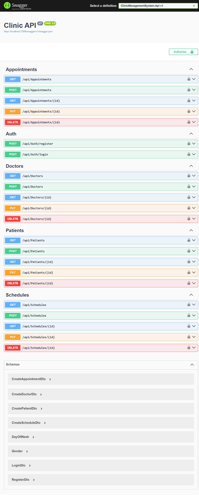

# 🏥 Clinic Management System API


A comprehensive, secure, and scalable **RESTful API** built with **.NET 8** to manage clinic operations. This project demonstrates modern software engineering practices, including **Clean Architecture**, **Repository Pattern**, and **JWT Authentication**.

## 📸 Screenshots



## 🏗️ Architecture

The solution follows the **Clean Architecture (Onion Architecture)** principles to ensure separation of concerns and maintainability:

* **Core:** Contains Domain Entities, DTOs, and Repository Interfaces. (No external dependencies).
* **Infrastructure:** Implements Data Access (EF Core), Migrations, Identity Services, and Repositories.
* **API:** The presentation layer containing Controllers and Dependency Injection setup.

## 🚀 Key Features

* **Authentication & Authorization:**
    * Secure User Registration & Login using **ASP.NET Core Identity**.
    * **JWT (JSON Web Tokens)** implementation for stateless authentication.
    * Role-based access control (Endpoints protected with `[Authorize]`).
* **Doctor Management:** Full CRUD operations with specialization tracking.
* **Patient Management:** Manage patient records securely.
* **Appointment Booking:**
    * **Business Logic Validation:** Prevents booking in the past.
    * **Availability Check:** Ensures doctors are available on specific days and times before booking.
* **Scheduling:** Manage doctor working hours and days.
* **Data Mapping:** Efficient object mapping using **AutoMapper**.

## 🛠️ Tech Stack

* **Framework:** .NET 8 Web API
* **Language:** C#
* **Database:** SQL Server
* **ORM:** Entity Framework Core (Code-First Approach)
* **Authentication:** JWT Bearer & Microsoft Identity
* **Tools & Libraries:**
    * `AutoMapper`
    * `Swashbuckle` (Swagger UI)
    * `Dependency Injection`

## ⚙️ Getting Started

Follow these steps to run the project locally:

### 1. Clone the Repository
```bash
git clone [https://github.com/muhmdramah/clinic-management-system.git](https://github.com/your-username/clinic-management-system.git)